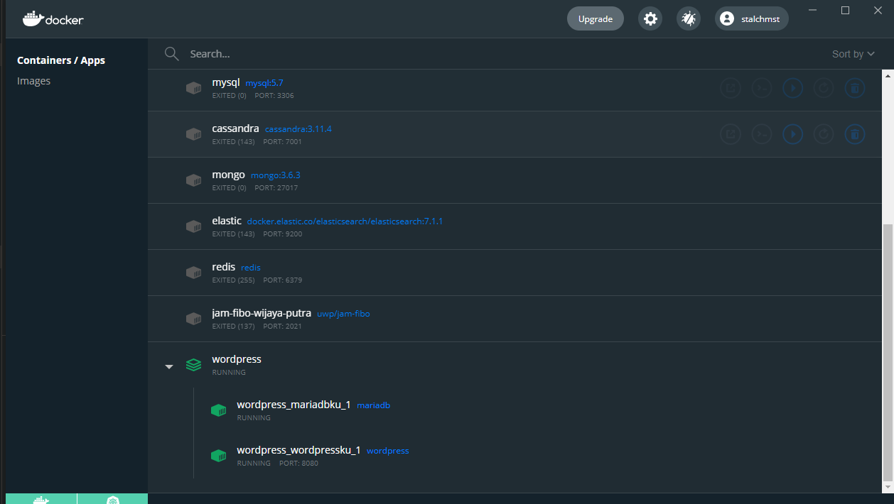
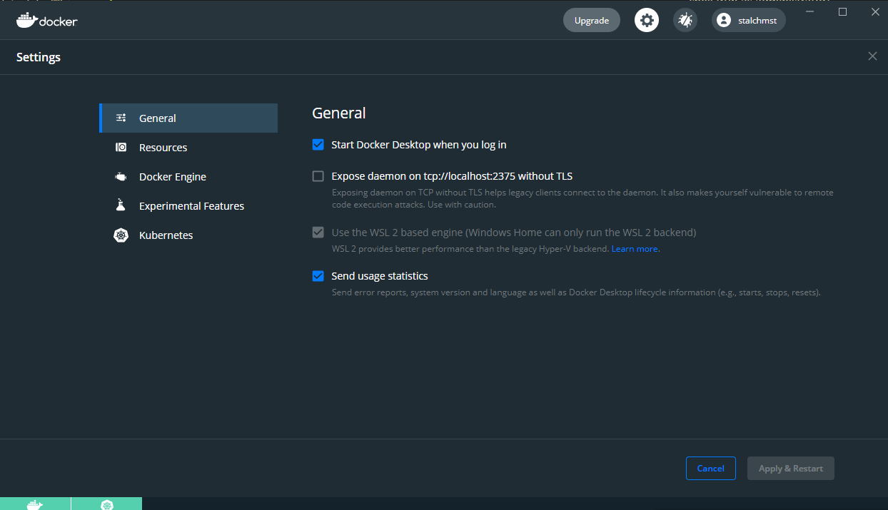

# Workshop Docker Universitas Wijaya Putra

Percobaan memakai docker compose

# Cara menjalankan

* Install [docker-desktop](https://www.docker.com/products/docker-desktop)
* Jalankan `docker-compose up`. Nanti akan terbentuk folder `database` dan `html`



# Masuk ke dalam container

Untuk masuk ke dalam container, bisa menjalankan perintah

```sh
# docker exec -it <nama-container> <command>
docker exec -it wordpress_wordpressku_1 /bin/bash
docker exec -it wordpress_mariadbku_1
```

# Integrasi WSL dan docker-desktop (windows 10)

Pertama-tama kita harus mengupdatse WSL ke versi 2. Caranya dengan membuka power shell (run as administrator)

```
PS C:\Windows\system32> wsl --list --verbose                                                                              NAME                   STATE           VERSION                                                                        * Ubuntu                 Running         2                                                                                docker-desktop         Running         2                                                                                docker-desktop-data    Running         2                                                                              
PS C:\Windows\system32> wsl --set-version ubuntu 2 
```

Setelah itu, kita perlu set supaya docker-desktop menggunakan WSL2 backend

